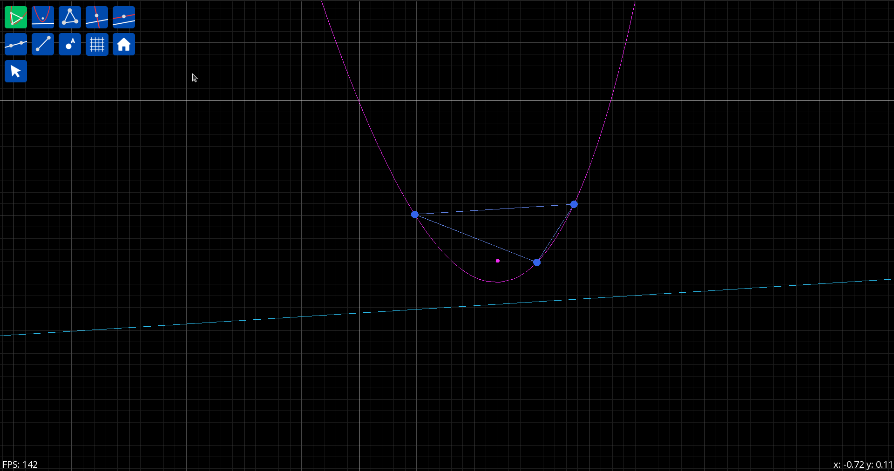

# Apollonius Graphica

Apollonius Graphica is a simple graphing tool for my work _On the Parabolas of Triangles_.
It is not a general-purpose graphing calculator, it contains basic geometric objects, and utilities for parabolas.



## Building

```
cmake -B build
cmake --build build
```

